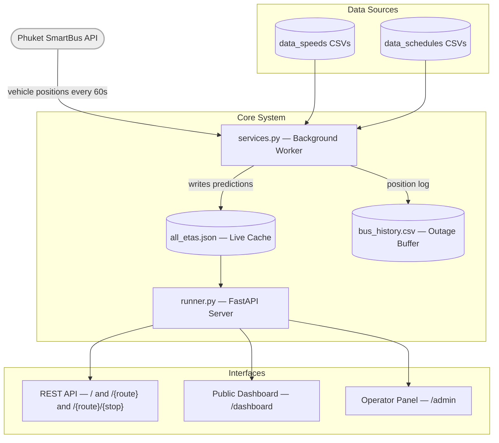

# Phuket Smart Bus ETA API

A **FastAPI-based backend system** that delivers real-time bus arrival predictions for Phuket SmartBus routes. The system integrates live vehicle telemetry from the official Phuket SmartBus API, calculates ETAs using historical speed profiles and scheduled departure data, and serves the results through both a REST API and a web dashboard.

It includes:
1. A **REST API** serving JSON data for mobile apps or third-party integrations.
2. A **Web Dashboard** for visualizing bus locations and ETAs.
3. An **Admin Panel** for manually flagging delays or issues on specific routes, and adding new bus routes / stops.

Built during an internship at City Development Solutions Co., Ltd (Oct–Dec 2025).

---
 
## Tech Stack
 
| Layer | Technology |
|---|---|
| Backend Framework | FastAPI (Python 3.9+) |
| Data Processing | Pandas |
| Background Threading | Python `threading` |
| Geospatial Data | GeoJSON |
| Data Storage | JSON cache, CSV logs |
| Frontend | Jinja2 HTML templates |
| API Docs | Swagger UI (auto-generated at `/docs`, default by FastAPI) |
 
---

## How It Works
 
The system runs two concurrent processes + one separate process:
 
**1. Main API Server (`runner.py`)**
- Serves REST endpoints and the web dashboard
- Reads from a local JSON cache (`all_etas.json`) on every request — ensures fast response times without calling the external API each hit
**2. Background Worker (`services.py`)**
- Runs every 60 seconds on a background thread
- Fetches live vehicle positions from the Phuket SmartBus API
- Cleans and processes position data using Pandas
- Calculates ETAs for every stop on every route using:
  - **Live bus position** → distance remaining to each stop
  - **Per-kilometre speed profiles** (from historical `data_speeds/` CSVs) → estimated travel time per segment
  - **Scheduled departures** (from `data_schedules/` CSVs) → upcoming buses not yet in service
- Writes results to `all_etas.json` (live cache) and `bus_history.csv` (outage buffer)
**3. Accuracy Checker (`accuracy_check.py`)**
- Runs as a separate process
- Polls live ETA predictions and records the predicted ETA at each timestamp
- When a bus actually arrives, logs the error (predicted − actual) to `eta_accuracy_archive.csv`
- Calculated data displayed in accuracy analytics graph in the admin panel



---

## Project Structure

```text
bus_eta_prediction/
│
├── runner.py                     # Main FastAPI entry point (App lifecycle, API routes & frontend mounting)
├── services.py                   # Core Engine: Data fetching, threading, ETA calculation logic
├── admin_logic.py                # Admin Backend: Handles file uploads, GeoJSON processing, and route configuration
├── stop_access.py                # Helper: Loads and parses route configurations from JSON
├── accuracy_check.py             # Background process: Validates ETA predictions against actual arrival times
│
├── routes_data.json              # Central Database: Stores all route configurations and stop data
├── all_etas.json                 # Live Cache: Auto-generated file containing current ETA predictions
├── bus_flags.json                # Live Cache: Stores manual status flags set by admins
├── bus_history.csv               # Log: Retains recent bus positions to handle short API outages
│
├── templates/                    # HTML/Jinja2 Frontend
│   ├── dashboard.html            # Public Display: Real-time ETA board for passengers
│   └── admin.html                # Admin Panel: System management interface
│
├── data_routes/                  # Storage: GeoJSON files for route paths
├── data_schedules/               # Storage: CSV files for bus departure schedules
├── data_speeds/                  # Storage: CSV/JSON files for historical speed data
│
├── .env                          # Environment variables (API Key)
├── requirements.txt              # Python dependencies
└── README.md                     # Documentation
```

---

## File Overview

| File | Purpose |
|------|----------|
| **`runner.py`** | The main application file. It sets up the FastAPI server, defines URL endpoints, and manages the startup/shutdown lifecycle of the background worker.|
| **`services.py`** | The engine room. It connects to the official Phuket SmartBus API, cleans the data (Pandas), calculates travel times, and updates the JSON cache. |
| **`accuracy_check.py`** | The file to check ETA accuracy over time, getting data of bus ETAs accuracy compared to time before bus arrives. |
| **`stop_access.py`** | A utility module that maps route "slugs" (URLs) to internal configuration objects. |
| **`all_etas.json`** | A local JSON cache updated every 60 seconds. The API reads from this file to ensure fast response times without hammering the external API. |
| **`.env`** | (Not included) Please create your own .env file for `API_KEY` variable, which stores the API key for the Phuket Smart Bus API.|

---

## Requirements

- **Python 3.9+**
- Internet connection (for live data)
- Environment variable `API_KEY` from Phuket SmartBus API in .env file

---

## Installation

1. **Clone the repository:**
   ```bash
   git clone https://github.com/parinwarishui/bus_eta_prediction.git
   cd bus_eta_prediction
   ```

2. **Create a virtual environment:**
   ```bash
   python -m venv venv
   source venv/bin/activate   # On macOS/Linux
   venv\Scripts\activate      # On Windows
   ```

3. **Install dependencies:**
   ```bash
   pip install -r requirements.txt
   ```

4. **Set up environment variables:**
   Create a `.env` file in the project root:
   ```bash
   API_KEY=your_phuket_smartbus_api_key_here
   ```

---

## Running the API

```bash
# Development (auto-reload on file changes)
uvicorn runner:app --reload
 
# Production
uvicorn runner:app --host 0.0.0.0 --port 8000
```
 
API available at `http://127.0.0.1:8000`  
Swagger docs at `http://127.0.0.1:8000/docs`
 
To run accuracy tracking alongside the main server (separate terminal):
```bash
python accuracy_check.py
```
This will start testing the accuracy of bus / stops ETA in real-time and add data to the archive which will be used in the accuracy graph.
The graph in the "Accuracy" tab of the admin page displays a plot of minutes of difference between ETAs and actual travel time of buses to different bus stops.

---

## REST API Reference
 
All endpoints return JSON. The system uses a local cache, so responses are fast regardless of external API latency.

### **GET** `/`

Returns the latest ETA data for all routes.

**Example Request:**
```
GET http://localhost:8000/
```

**Example Response:**
```json
{
  "data": {
    "Airport -> Rawai": {
      "route": "Airport -> Rawai",
      "updated_at": "2025-12-02T14:46:52.764704",
      "route_status": "active",   
      "route_message": null,
      "stops": {
        "Phuket Airport": {
          "no": 42,
          "index": 3,
          "stop_name_eng": "Phuket Airport",
          "stop_name_th": "สนามบิน ภูเก็ต",
          "lat": 8.10846,
          "lon": 98.30655,
          "stop_status": "open",
          "stop_message": null,
          "upcoming": [
            {
              "licence": "10-1204",
              "eta_min": 0,
              "eta_time": "2025-12-02T14:46:52.423626",
              "status": "Active",
              "message": "Normal Operation",
              "type": "active"
            },
            {
              "licence": "Scheduled",
              "eta_min": 13,
              "eta_time": "2025-12-02T14:59:52.423626",
              "status": "Scheduled",
              "message": "Normal Operation",
              "type": "scheduled"
            },
            {
              "licence": "Scheduled",
              "eta_min": 43,
              "eta_time": "2025-12-02T15:29:52.423626",
              "status": "Scheduled",
              "message": "Normal Operation",
              "type": "scheduled"
            }
          ]
        }
      }
    }
  }
}
```

### **GET** `/{route_name}`

Returns the latest ETA data for a specific route.

**Example Request:**
```
GET http://localhost:8000/airport-rawai
```

**Example Response:**
```json
{
  "route": "Airport -> Rawai",
  "updated_at": "2025-12-02T14:46:52.764704",
  "route_status": "active",
  "route_message": null,
  "stops": {
    "Phuket Airport": {
      "no": 42,
      "index": 3,
      "stop_name_eng": "Phuket Airport",
      "stop_name_th": "สนามบิน ภูเก็ต",
      "lat": 8.10846,
      "lon": 98.30655,
      "stop_status": "open",
      "stop_message": null,
      "upcoming": [
        {
          "licence": "10-1204",
          "eta_min": 0,
          "eta_time": "2025-12-02T14:46:52.423626",
          "status": "Active",
          "message": "Normal Operation",
          "type": "active"
        },
        {
          "licence": "Scheduled",
          "eta_min": 13,
          "eta_time": "2025-12-02T14:59:52.423626",
          "status": "Scheduled",
          "message": "Normal Operation",
          "type": "scheduled"
        },
        {
          "licence": "Scheduled",
          "eta_min": 43,
          "eta_time": "2025-12-02T15:29:52.423626",
          "status": "Scheduled",
          "message": "Normal Operation",
          "type": "scheduled"
        }
      ]
    }
  }
}
```

### **GET** `/{route_name}/{stop_no}`

Returns the latest ETA data for a specific stop in a specific route.

**Example Request:**
```
GET http://localhost:8000/airport-rawai/43
```

**Example Response:**
```json
{
  "no": 43,
  "index": 2368,
  "stop_name_eng": "Thalang Public Health Office",
  "stop_name_th": "สำนักงานสาธารณสุข ถลาง",
  "lat": 8.034014,
  "lon": 98.333571,
  "stop_status": "open",
  "stop_message": null,
  "upcoming": [
    {
      "licence": "10-1148",
      "eta_min": 4,
      "eta_time": "2025-12-02T14:51:54.209948",
      "status": "Active",
      "message": "Normal Operation",
      "type": "active"
    },
    {
      "licence": "Scheduled",
      "eta_min": 29,
      "eta_time": "2025-12-02T15:16:54.209948",
      "status": "Scheduled",
      "message": "Normal Operation",
      "type": "scheduled"
    },
    {
      "licence": "Scheduled",
      "eta_min": 59,
      "eta_time": "2025-12-02T15:46:54.209948",
      "status": "Scheduled",
      "message": "Normal Operation",
      "type": "scheduled"
    }
  ]
}
```

---

## Web Interface

### `/dashboard`

Public-facing dashboard. Select a route and stop to see live ETAs.
Dashboard can be keyed for specific routes / bus stops dynamically. e.g. /dashboard/airport-rawai/42

### `/admin`

Internal admin page for various functions.
- View Routes
- Add New Route
- Flag Bus / Stop / Route (for delays / inactive / closing)
- Analytics (ETA accuracy)

### `/docs`

Access Swagger UI to test API endpoints manually.

---

## Dashboard Page Guide

### Viewing ETA

- Please select a route first then select stop.
- View the 3 upcoming buses ETA

### Dynamic Links

- You can key in route and stop no. to directly get ETA of that specific route & stop.
- e.g. http://127.0.0.1:8000/dashboard/bus-2-bus-1-patong/76 
  - returns ETA of **"Bus 2 -> Bus 1 -> Patong"** route at **stop no. 76 "Andamanda Phuket Waterpark"**
- keying in a route that does not exist will return error message
- keying in a stop no. that is not part of the route will return error message.

---

## Admin Page Guide

Access at:
➡️ http://127.0.0.1:8000/admin

### View Routes
- Select a route
- Preview of the route and its stops on the map.
- List of Stops and its data (No. / Eng / Thai / Coordinates / Index (on the 5m points))
- Allow admin to add new stops (with the data mentioned above, Index is auto-mapped) or remove stops.

### Editor
- Add new bus route
- Fill in **Route Name, Line, Buffer, Direction** (according to the message in Phuket Smart Bus API).
- Attach **GeoJSON File** of the route (make sure ALL coordinates are in order from top to bottom) format as follows.

```json
{
"type": "FeatureCollection",
"name": "airport_rawai",
"crs": { "type": "name", "properties": { "name": "urn:ogc:def:crs:OGC:1.3:CRS84" } },
"features": [
{ "type": "Feature", "properties": { "Id": 0, "lat": 867713.494 }, "geometry": { "type": "Point", "coordinates": [ 98.293235119708498, 7.849391077160541 ] } },
{ "type": "Feature", "properties": { "Id": 0, "lat": 867712.459 }, "geometry": { "type": "Point", "coordinates": [ 98.293279455503139, 7.8493817939272 ] } },
// more points ...
]
}

```

- Add **Schedule CSV File** (time bus departs from start) in the structure below.

| [Starting Point]    |
| -------- |
| 08:00  |
| 09:00 |
| 10:00    |
and so on...

- Add **Speeds CSV File** (Optional) in structure below.

| index | km_interval | avg_speed | count | km_label |
| -------- | -------- | -------- | -------- | -------- |
| 0 | 0 | 23 | 3546 | KM 0-1 |
| 1 | 1 | 25 | 2726 | KM 1-2 |
and so on...

### Status

- **Route Status:** choose a route and set Active / Suspend.
- **Stop Status:** choose a route → choose a stop → set Open / Close.
- **Bus Status:** enter plate/license → set Active / Delayed / Inactive + message + optional auto-expire duration (mins).

### Accuracy Analytics

- View historical stats of **ETA accuracy**.
- Scatter plot: ETA error (minutes) vs. time before actual arrival (minutes).
- Error bars show ± standard deviation across historical records.
- Reveals how prediction accuracy degrades as lookahead time increases.

---
 
## ETA Calculation Logic
 
For each active bus, the system:
 
1. Gets the bus's current position (lat/lon) from the external API
2. Snaps it to the nearest point on the route GeoJSON geometry
3. Iterates forward through all remaining stops
4. For each km segment between the bus and a stop, applies the average historical speed from `data_speeds/`
5. Sums the segment times to produce `eta_min`
6. If no speed data is available for a segment, falls back to a default speed constant
Scheduled buses (not yet in service) are included in `upcoming[]` based on departure time + historical average travel time to each stop.
 
---

## Current Limitations & Future Improvements

### No Admin Login System

The `/admin` panel is currently unprotected. Authentication for admin logins to access the admin page is necessary.

### Files-based Storage

Routes and flags are currently stored in JSON/CSV. A proper database (SQLite or PostgreSQL) would improve reliability for concurrent writes.

### Single-server deployment

The background worker and API share one process. For scale, these should be decoupled (e.g., worker writes to a shared DB, API reads from it).

### No Bulk Stop Upload

A future improvement is to allow uploading of CSV files of stops in bulk when adding a new route.

### No Manual Input of Speed / CSV

A future improvement is to allow manual input of speeds and scheduled departures.


---
 
## Acknowledgements
 
This project was built as part of a transit digitalization project for Phuket's Smart Bus network. The system processes live GPS telemetry from the [Phuket SmartBus](https://phuketsmartbus.com) API and delivers arrival predictions to passengers and operators.

A huge thank you to City Development Solutions Co., Ltd for the opportunity to work on a real, deployed transit system during my internship (Oct–Dec 2025). The trust placed in me to design and build production backend infrastructure as a second-year university student was an unforgettable experience.

Thank you to the team for the guidance, feedback, and patience throughout the project — and for providing API access that made the real-time prediction system possible.

This project was my first time building a production backend from end to end. I have learned about system design and API integration then got to apply it by creating a real-world solution.


